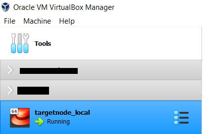
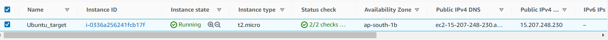
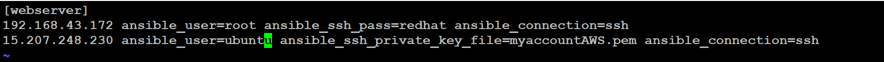
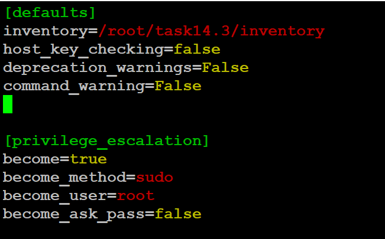

# Dynamically SoftwareName Take According OStype and Configure Webserver

#### I have two traget nodes one traget node is running in my local VM which is redhat8 and another trarget node in running in the AWS cloud service ec2 this traget node is Ubuntu OS .

## This target node 1 : Redhat OS

## This target node 2 : Ubuntu OS : ec2 instance

## In controller node I have inventory file in which I have mentioned the target node IP and other information

## This is ansible.cfg file

In my second target node ansible login using SSH with the ubuntu user power but some task will perform using root power so in my inventory file I have mentioned the keyword [privilege_escalation] .
